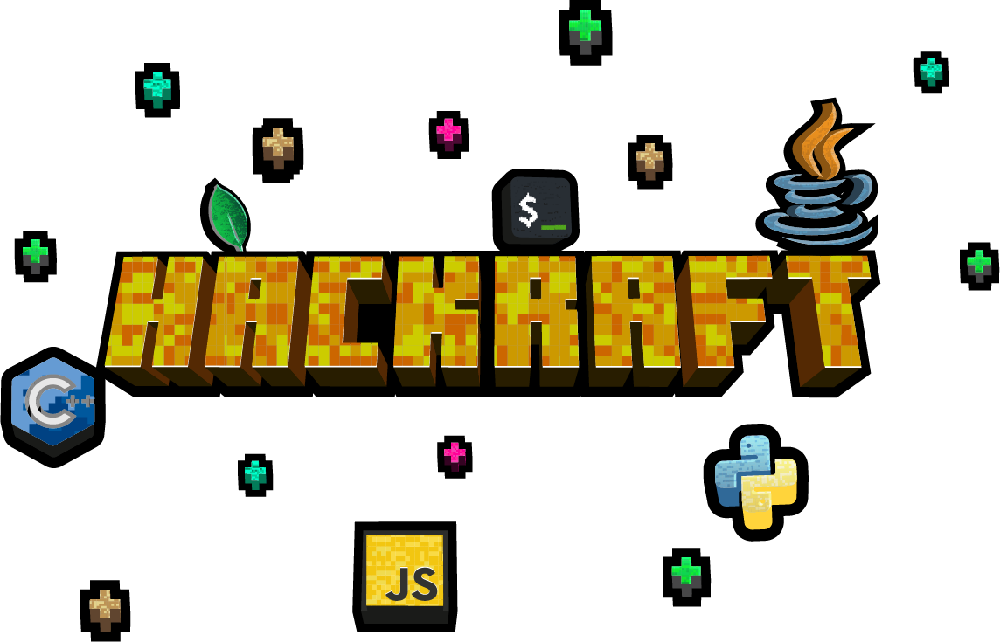

# Welcome to Hackraft 👾

This repository contains details regarding the program. Please go through this entire document before starting out!

### What is Hackraft?

Hackraft is a Project Building Series conducted by Randomize - MUJ during the month of June & July 2021.
 

### Who is this exactly for?

This project series is aimed for all students of Manipal University Jaipur who want to utilize thier summer vaccations by building technical projects.
 

### Are there any prerequisites?

Willingness to learn 😄
 

### Do I need to submit the final project?

No. The main aim of this series is to encourage the culture of project building among the students.

 

## Initial Steps
 

1. Make a GitHub Repository (and add your teammates as contributors)
2. Drop the link to the repository in the `share-your-project` channel on Discord
3. Prepare a Roadmap. Refer to [Roadmap.md](https://github.com/Hackraft/Hackraft/blob/master/Roadmap.md) if you want a starting template.

 

## Roadmap and Planning

 
Prepare a rough roadmap which you intend to follow while building the project. You can mention what language/frameworks/libraries you will be using. Also mention the milestones in a weekly manner. This will help you in checking your progress and staying organized throughout the lifecycle of your project

 
 

## Events and Workshops

 

We will be coducting hands-on workshops and events on relevant topics and technologies which you can integrate in your project

